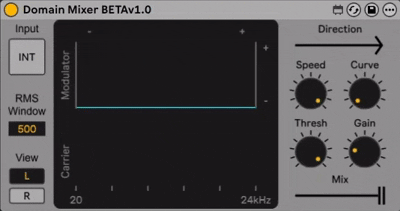

# M4L Domain Mixer

 

> The M4L device in this repository is not Frozen. If you intend to use the effect in Ableton Live, please download the device from the official Max for Live website (https://maxforlive.com/profile/user/WesDaMooch) to avoid conflicts with different versions.

 

  

 

The Domain Mixer is a Max for Live effect for Ableton Live 12. The device takes a traditional stereo two-channel mixer and turns it on its side. Now, instead of blending audio amplitudes, the spectral content of one signal is modulated by the amplitude envelope of another — the frequency domain mixed with the time domain.

 

## Overview and Audio Demo Video

 

  
  
  

 

## Change Log
### [BETAv1.0] - 18/07/2025
- Beta goes live.

 

## License
This project is licensed under the MIT License.  
Copyright (c) 2025 Wesley Lawrence Leggo-Morrell (wes.mm@outlook.com)
